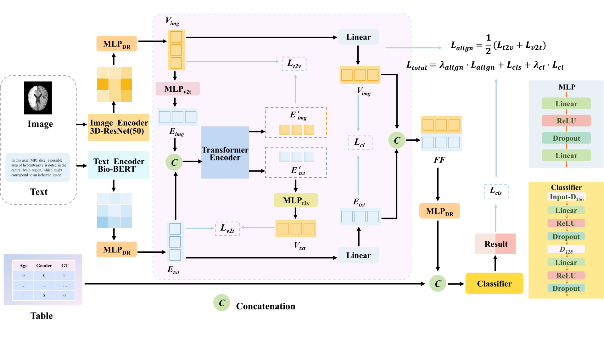

# Stroke Multimodal Prognosis Prediction

A PyTorch implementation of **OursFusion** — a Vision-Guided Dual Alignment Fusion model for stroke functional prognosis prediction using pre-encoded multimodal features (tabular clinical data, MRI image features, and clinical text features).

> **Reproducibility**: All encoded feature data are included in `data/encoded/`. No external data download is required. Clone and run.



---

## Method Overview

OursFusion fuses three modalities through a two-stage pipeline:

1. **Vision-Guided Text Encoder** — maps image and text features into a shared hidden space via a lightweight 1-layer Transformer, enabling bidirectional cross-modal interaction.
2. **Dual Alignment** — enforces cross-modal consistency with two auxiliary losses:
   - *Contrastive loss* (InfoNCE) on low-rank projected features
   - *Alignment loss* (symmetric cosine calibration) in hidden space
3. **Fusion + Classifier** — concatenates the fused multimodal representation with tabular features for binary prognosis prediction (good / poor outcome).

Total training objective:

```
L = L_cls + λ_cl · L_contrastive + λ_align · L_alignment
```

---

## Project Structure

```
stroke_multimodal_prognosis/      ← project root (you are here)
│
├── main.py                       # Training entry point
├── config.py                     # All hyper-parameters and data paths
├── requirements.txt
│
├── data/
│   ├── encoded/                  # Pre-encoded feature files (included)
│   │   ├── clinic_data_1.xlsx                          # Tabular features + labels
│   │   ├── image_feature.xlsx                          # Image features (3D ResNet-50)
│   │   └── medical_text_features_by_qianwen_best.xlsx  # Text features (Qianwen LLM)
│   ├── loader.py                 # load_data() – reads Excel feature files
│   ├── dataset.py                # MultimodalDataset with per-modality StandardScaler
│   └── augmentation.py           # SMOTE strategies + WeightedRandomSampler
│
├── models/
│   ├── ours_fusion.py            # OursFusion + VisionGuidedTextEncoder (primary model)
│   └── fusion_modules/
│       └── vdafm.py              # Advanced VDAFM variant (ablation reference)
│
├── training/
│   ├── scheduler.py              # RAdam optimizer + cosine-warmup LR scheduler
│   ├── loops.py                  # train_one_epoch(), evaluate()
│   └── pipeline.py               # Optuna HPO objective + train_and_plot_final_model()
│
├── utils/
│   ├── helpers.py                # set_seed, save/load_checkpoint, EarlyStopping
│   └── metrics.py                # compute_metrics, compute_optimal_threshold
│
└── picture/
    └── framework.png             # Model architecture diagram
```

---

## Requirements

- Python 3.8+
- PyTorch 2.0+
- CUDA (optional — GPU used automatically if available)

Install all dependencies:

```bash
pip install -r requirements.txt
```

`requirements.txt`:

```
torch>=2.0.0
numpy>=1.24.0
pandas>=2.0.0
scikit-learn>=1.3.0
imbalanced-learn>=0.11.0
matplotlib>=3.7.0
optuna>=3.0.0
openpyxl>=3.1.0
```

---

## Quick Start

```bash
# 1. Enter the project directory
cd stroke_multimodal_prognosis

# 2. Install dependencies (first time only)
pip install -r requirements.txt

# 3. Run training
python main.py
```

That's it. No path configuration needed — data paths are resolved automatically relative to the project directory.

---

## Output

After training, results are saved to `experiments/`:

```text
experiments/
├── best_config.json          # Best hyper-parameters found by Optuna
├── seed_39/
│   ├── best_model.pth        # Model weights with best validation AUC
│   ├── training_metrics.png  # Loss / AUC / LR curves
│   └── test_results.json     # Test-set metrics for this seed
├── seed_40/
├── seed_41/
├── seed_42/
└── summary_all_seeds.json    # Mean ± std across all seeds
```

---

## Configuration

All hyper-parameters are defined in [`config.py`](config.py). Edit that file to customise training:

| Parameter | Default | Description |
| --- | --- | --- |
| `epochs` | 100 | Maximum training epochs |
| `batch_size` | 64 | Mini-batch size |
| `learning_rate` | 1e-4 | Initial learning rate |
| `hidden_dim` | 512 | Cross-modal interaction dimension |
| `projection_dim` | 256 | Low-rank projection bottleneck |
| `num_heads` | 16 | Transformer attention heads |
| `dropout_rate` | 0.5 | Dropout probability |
| `lambda_cl` | 0.02 | Contrastive loss weight |
| `lambda_align` | 0.20 | Alignment loss weight |
| `smote_method` | `tabular_copy` | Class-balancing strategy |
| `num_random_seeds` | 4 | Number of evaluation seeds (39–42) |
| `test_size` | 0.2 | Held-out test set fraction |

---

## Model Architecture

### OursFusion

```text
Inputs
 ├── tabular  (B, D_tab) ──────────────────────────────────────────► cat ──► Classifier ──► logits
 ├── image    (B, D_img) ──► VisionGuidedTextEncoder ──► image_proj ──► FusionReduce ──┘
 └── text     (B, D_txt) ──┘                          └──► text_proj ──┘

Auxiliary losses
 ├── L_contrastive = InfoNCE(image_proj, text_proj)          [weight: λ_cl]
 └── L_align       = 0.5·(1 − cos(g_i(E_img), E_txt))
                   + 0.5·(1 − cos(g_t(E_txt), E_img))       [weight: λ_align]
```

### VisionGuidedTextEncoder

1. Project image and text features independently into a shared hidden space.
2. Generate a vision-conditioned token via MLP: `E_img = f_v2t(W_v · x_img)`.
3. Stack `[E_img, E_txt]` as a 2-token sequence; feed into a 1-layer Transformer to exchange cross-modal information.
4. Return aligned tokens `E_img_encoded`, `E_txt_encoded` for downstream fusion and loss computation.

---

## Data

This project uses **pre-encoded feature vectors**. Raw MRI images and clinical notes are private and not released.

| File | Contents | Encoder |
| --- | --- | --- |
| `clinic_data_1.xlsx` | Tabular clinical features + binary outcome label | Structured data |
| `image_feature.xlsx` | Image feature vectors | 3D ResNet-50 |
| `medical_text_features_by_qianwen_best.xlsx` | Text feature vectors | Qianwen LLM |

The three files are merged on the `id` column before training.

---

## Evaluation Metrics

| Metric | Description |
| --- | --- |
| AUC | Area under ROC curve |
| Accuracy | Overall classification accuracy |
| F1 | Harmonic mean of precision and recall |
| Precision | Positive predictive value |
| Recall (Sensitivity) | True positive rate |
| Specificity | True negative rate |

---

## Citation

If you use this code, please cite the corresponding paper (to be updated upon publication):

```bibtex
@article{ourstroke2025,
  title   = {Multimodal Stroke Prognosis Prediction via Vision-Guided Dual Alignment Fusion},
  author  = {},
  journal = {},
  year    = {2025}
}
```
